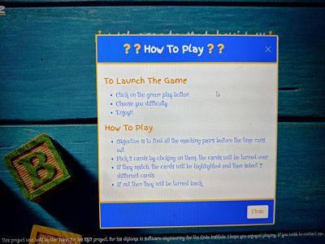
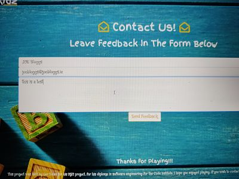
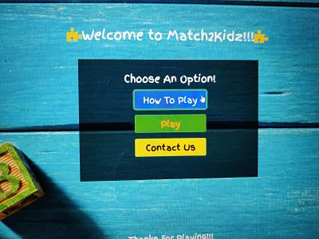
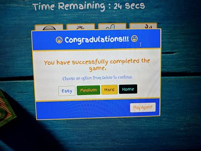

MATCH 2 KIDZ
===

A simple game of matching two cards by type or by colour.
By using HTML, CSS and Javascript to give an enjoyble experience
to kids and families while also being very easy to use. 
The game focuses on getting the kids ability to interpret what they 
see visually and on them being able to identify a corresponding 
card. They can chose from 3 difficulty levels and have and option 
of replaying on a harder or easier difficuty when they win or lose the game.

## **Table Of Contents:**

* [UX](#ux) 
    * [Project Goals](#project-goals)
    * [User Goals](#user-goals)
    * [User Stories](#user-stories)
    * [Site Owner Goals](#site-owner-goals)
    * [Design Choices](#design-choices)
* [Technologies](#technologies-used)
* [Features](#features)
* [Testing](#testing)
* [Deployment](#deployment)
* [Credits](#credits)

## UX (User Experience)
___

### Project Goals

The main goal of this project is to offer children an enjoyable experience 
of a matching game while also developing their skills in problem solving, recognising patterns, seeing a card and remembering 
where that card is positioned. The game consists of a game board with 12 cards placed face down and the user can pick 2 cards at a time 
to try and match them. If the user guesses correctly the cards stay turned, if not they get turned back face down. The user 
has to match all the cards before the timer runs out.

### User Goals

* Find out how to play the game.
* Be able to start the game.
* Replay the game.
* Be able to contact the site owner 

### User Stories 

* As a user I want to be able to start the game as fast as possible.
* As a user I want to be able to see the rules and methods of how to play the game.
* As a user I want to be able to contact the owner of the site for more information or to leave feedback.
* As a user I want the site to be pleasant on the eye with nice backgrounds and appropriate typography.
* As the parent of a user of the site I want the site to be easy to navigate, intuitive and easy for kids to learn.

#### Below are some screenshots of the features/ designs put in place to satisfy user goals and stories

### Site Owner Goals

* As the site owner I want to deliver a site that is fun and easy to use for kids.
* As the site owner I want the game to be fun and also be able the users ability to identify and match objects and make them comfortable using the site,
* As the site owner I want the users to be able to contact me easily via email to hear their opinions and leave feedback.

### User Requirements and Expectations

#### Requirements

* All the buttons, including the matching card buttons work as expected.
* The game works as the user intends and gives the user the appropriate feedback.
* When the game is over, the game resets to the start.

#### Expectations

* Well layed out website.
* Nicely styled with contrasting fonts and background images.
* All the user actions to be tracked and shown on screen.

## Design Choices
---

The design That I have chosen for this site is inspired by my kids preschool 
and from all the games and books that  they have.
I have chosen a light blue background image with a fun type font to make it 
fun friendly and inviting. It will consist of 3 pages , A landing page, index.html, a game page game.html, and a contact page.
The pages will consist a logo, navbar and a footer with the content of each page displayed between the navbar and the footer. 

**Fonts**

The fonts I chose for this project both came from Google Fonts. For the title and headings I have chosen the style of [Finger Paint](https://fonts.google.com/specimen/Finger+Paint?preview.text_type=custom).
For the pararagraphs and other cont I have chosen [Mystery Quest](https://fonts.google.com/specimen/Mystery+Quest?preview.text_type=custom).

**Icons**

The Icons I used for this project are straightforward and I got them from [fontawesome](https://fontawesome.com/).

**Colors**

The colors I used were very basic, but kept with the theme and the background colour.

* for the background I used a light blue background picture.
* for the borders and text elements I used whitesmoke.
* for the icons I used gold.

### Wireframes

For my wireframes I used [Balsamiq](https://balsamiq.com/wireframes/desktop/?os=win&gclid=CjwKCAiAxp-ABhALEiwAXm6IyV8YHkGFytprKnOnoi0yGg7QpPzpo7NLGpkNpaKh5Z5ypPynFnNNEhoCKOMQAvD_BwE#).
I uploaded my wireframes to my assets folder and you can view them [here](https://github.com/Gertobin11/match2kidzgame/blob/master/assets/wireframes/wireframes.pdf).
My layout hs changed quite a bit in development but the main change is changing the game from 16 cards to 12 cards because in the mobile version 
you had to scroll to be able t see cards and I thought that it wasnt user friendly.

## Features
---

### Features that have been **implemented**

* Clear Navigation that collapses into a button/ toggler when on smaller devices.
* Colorful buttons for the user to click to find out how to play the game, start the game and go to the contact page.
* Links to our social media accounts.
* Responsive Game with a timer, with nice animations.

### Features which will be added **later**

* Add a new game mode i.e. tic tac toe
* Add a leaderboard.

## Technologies used
---

### Languages

* [HTML](https://www.w3schools.com/html/html_intro.asp)
* [CSS](https://www.w3schools.com/css/css_intro.asp)
* [Javascript](https://developer.mozilla.org/en-US/docs/Web/JavaScript)

### Libraries and Tools

* [Bootstrap](https://getbootstrap.com/)
* [JQuery](https://jquery.com/)
* [Fontawesome](https://fontawesome.com/)
* [Hover.css](https://ianlunn.github.io/Hover/)
* [Google Fonts](https://fonts.google.com/)
* [Git](https://git-scm.com/)
* [Popper](https://popper.js.org/)
* [Paint](https://support.microsoft.com/en-us/windows/get-microsoft-paint-a6b9578c-ed1c-5b09-0699-4ed8115f9aa9)
* [EmailJS](https://www.emailjs.com/)

## Testing 
---

### Manual Testing

The first round of testing I did was the testing of features and requirements that my users would have conveyed in the user stories segnment.
I have catalogued all the testing that I did [here](testing.md). Also throughout the development process I have been continually testing and 
checking for errors and bugs, where they have caused an issue, I have stated and fixed them in my [commits](https://github.com/Gertobin11/match2kidzgame/commits/master).

  

[Manual Tests Here!!!](testing.md)

### Testing with Validators

#### HTML 

The HTML files I've tested with [HTML Validator](https://validator.w3.org/) which gave me 2 errors for index.html for putting my a tag elements outside the button elements , 
you can see the results [here](assets/images/test-images/index-page-validation-fail.jpg).So I just deleted the button and changed the a role to button and this sorted the problems.
 After doing that edit  I Passed it through the validator again and it Passed,with no errors , 
 you can see the result [here](assets/images/test-images/index-page-validation-pass.jpg). The next page I checked was my game.html page , but before I ran it I corrected any button tag 
 which was inside an a tag ,After doing that it passed straight away. You can see the result [here](assets/images/test-images/game-page-validation-pass.jpg). The last page of html I passed through was my contact.html.  I had a section 
 to provide a map for users but I found this unnessacery So i removed this section and made sure my cdns were matching the other pages.  It passed 
 and you can check the results [here](assets/images/test-images/contact-page-validation-pass.jpg).

#### CSS

The CSS file I've tested with with [CSS Validator](http://jigsaw.w3.org/css-validator/) which Passed FIRST GO!!!
You can see the result [here](assets/images/test-images/css-validator-pass.jpg)

#### Javascript

The Javascript files Iv'e tested with [JShint](https://jshint.com/) which threw up a few [errors](assets/images/test-images/jshint-result-after-fixing-semi-colon-issue.png) , which were mainly a few missing semi colons,
but after I fixed that I had 5 undeclared variables which  4 were the arguments(easy,medium,hard,count) that I put into my function, So I declared those and I was left with an undeclared $ from using jQuery. I just econfigured 
the JSHint to include JQuery and new Javascript features (es6) and it has shown no faults. You can see the last passed test [here](assets/images/test-images/jshint-validation-pass.jpg).

#### Testing The Deployed Site
I ran my site through the validators when I deployed it on GitHub pages and it passed all the html tests on 1st go. [index](assets/images/test-images/deployed-index-test.jpg), 
[game](assets/images/test-images/deployed-game-test.jpg), and [contact](assets/images/test-images/deployed-contact-test.jpg). I tested the css and the I got no errors or warnings with my code but I got 17 from the 
bootstrap cdn.You can see the result [here](assets/images/test-images/deployed-css-test.jpg).
I also carried out the same manual testing and found no errors on the deployed version.

#### All the test images can be found in this [folder](https://github.com/Gertobin11/match2kidzgame/tree/master/assets/images/test-images)

## Deployment

### Steps taken when I deployed the website on github pages

* Match2Kidz was created in github , developed in gitpod and deployed on github pages.
* To deploy I opened up github and logged in using my username and password.
* On the left hand side of the page shows my repositories and I selected Gertobin11/match2kidzgame.
* Clicked on the settings Icons.
* Scrolled down to github pages.
* Click on the source box, it says none , so changed that to master and pressed save.
* Match2Kidz website is live on github pages.

### Running it locally

* In the browser window type "https://github.com/Gertobin11/match2kidzgame" into the address bar.
* Click on the download code button.
* In the dropdown menu you can clone the repository or clck on the download link
* Open up your favourite IDE and clone the repository orupload the files that you downloaded.
* Or if our a gitpod user simply press the green gitpod button to open it up in your gitpod workspace.

## Credits

* The images for my cards were downloaded from [pixabay](https://pixabay.com/) where searching for animal in the search bar 
brought up the images I needed. The background image I used I downloaded from [SHUTTERSTOCK](https://www.shutterstock.com/image-photo/close-arrangement-alphabet-on-blue-background-1011417973)
* The work we did in class in the Code Institue really helped me with my understanding of Javascript for thi project.
* [Stackoverflow](https://stackoverflow.com/) for when I got stuck and needed inspiration !!
* This [video](https://www.youtube.com/watch?v=ZniVgo8U7ek) which gave me the idea of putting both images inside a div and flipping 
it while preserving 3d!
* A big thanks to my mentor Ignatius Ukwuoma, who went above and beyond to help me with this project and whose knowledge and insight in 
Javascript were invaluable.
* To my son Mason and to Robbie Keane(not the football player but my friends very bright 6 year old son) whose keen eyes and 
clever thinking helped me immeasurably.